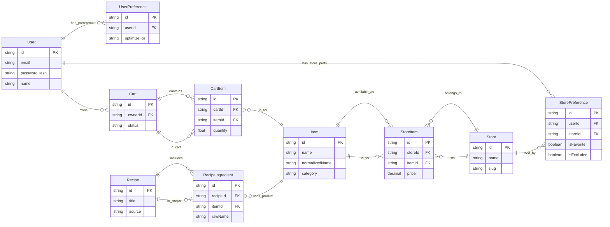

# Database Relationship

This diagram shows the relationships between tables in the database schema.

```mermaid
erDiagram
    direction LR

    User {
      string id PK
      string email
      string passwordHash
      string name
    }

    UserPreference {
      string id PK
      string userId FK
      string optimizeFor
    }

    StorePreference {
      string id PK
      string userId FK
      string storeId FK
      boolean isFavorite
      boolean isExcluded
    }

    Store {
      string id PK
      string name
      string slug
    }

    Item {
      string id PK
      string name
      string normalizedName
      string category
    }

    StoreItem {
      string id PK
      string storeId FK
      string itemId FK
      decimal price
    }

    Cart {
      string id PK
      string ownerId FK
      string status
    }

    CartItem {
      string id PK
      string cartId FK
      string itemId FK
      float quantity
    }

    Recipe {
      string id PK
      string title
      string source
    }

    RecipeIngredient {
      string id PK
      string recipeId FK
      string itemId FK
      string rawName
    }

    %% Relationships

    User ||--o{ UserPreference : has_preferences
    User ||--o{ StorePreference : has_store_prefs
    User ||--o{ Cart : owns
    Store ||--o{ StorePreference : used_by
    Store ||--o{ StoreItem : lists
    Item ||--o{ StoreItem : available_as
    StoreItem }o--|| Store : belongs_to
    StoreItem }o--|| Item : is_for
    Cart ||--o{ CartItem : contains
    CartItem }o--|| Item : is_for
    CartItem }o--|| Cart : in_cart
    Recipe ||--o{ RecipeIngredient : includes
    RecipeIngredient }o--|| Item : uses_product
    RecipeIngredient }o--|| Recipe : in_recipe
```
